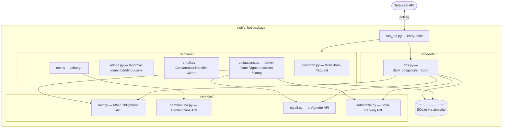

# notify-telegram-bot

A private Telegram bot for Bulgarian government service checks and daily
notifications.  Supports multiple approved users, each with their own
stored profile (national ID, driving licence, vehicle plate).

---

## Features

- **User enrollment & admin approval** — users request access; the admin
  approves/denies via inline Telegram buttons.
- **MVR obligations** — check traffic fines and document obligations via the
  Bulgarian Motor Vehicle Administration API.
- **Road e-vignette** — check e-vignette status via [bgtoll.bg](https://check.bgtoll.bg/).
- **Sofia parking sticker** — check city parking zone sticker via
  [sofiatraffic.bg](https://www.sofiatraffic.bg/en/parking).
- **Wheel-clamp check** — check whether your car is clamped in Sofia.
- **EUR exchange rates** — live CambioCuba rates (public, no approval needed).
- **Daily scheduled report** — automatic morning check of obligations,
  vignette, sticker, and clamp status for all approved users.

---

## Commands

### Public (no approval required)

| Command | Description |
|---|---|
| `/start` | Welcome message and current access status |
| `/help` | Full command reference |
| `/request` | Send an access request to the admin |
| `/change` | EUR exchange rates (Cuba) |

### Approved users only

| Command | Description |
|---|---|
| `/enroll` | Wizard to save national ID, driving licence, and plate |
| `/driver` | Check driving licence obligations (MVR API) |
| `/plate` | Check vehicle obligations (MVR API) |
| `/vignette [PLATE]` | Check road e-vignette status (bgtoll.bg) |
| `/sticker [PLATE]` | Check Sofia parking sticker (sofiatraffic.bg) |
| `/clamp [PLATE]` | Check wheel-clamp status (sofiatraffic.bg) |

`[PLATE]` is optional — if omitted, the plate stored via `/enroll` is used.

### Admin only

| Command | Description |
|---|---|
| `/approve <user_id>` | Approve a pending user |
| `/deny <user_id>` | Deny a pending user |
| `/pending` | List users awaiting approval |
| `/users` | List all approved users |

---

## Quick Start

### Docker Compose (recommended)

1. Copy `config.json.tpl` to `config.json` and fill in your values, **or** set
   environment variables directly.
2. Create a `data/` directory for SQLite persistence:
   ```sh
   mkdir -p data
   ```
3. Start the bot:
   ```sh
   docker compose up -d
   ```

### Local development

```sh
# Install dependencies
uv sync

# Set required environment variables
export TOKEN="your-telegram-bot-token"
export ADMIN_TELEGRAM_ID="your-telegram-user-id"

# Run the bot
uv run python -m notify_bot.run_bot

# Run tests
uv run pytest tests/
```

---

## Environment Variables

| Variable | Required | Default | Description |
|---|---|---|---|
| `TOKEN` | ✅ | — | Telegram Bot API token (from @BotFather) |
| `ADMIN_TELEGRAM_ID` | ✅ | `0` | Your Telegram user ID (integer) |
| `DATABASE_PATH` | | `/app/data/bot.db` | SQLite database file path |
| `DAILY_REPORT_TIME` | | `08:00` | Daily report time in `HH:MM` UTC |
| `LOGLEVEL` | | `INFO` | Python logging level |

---

## Architecture



---

## Project Structure

```
notify_bot/
  __init__.py
  run_bot.py           — entry point
  config.py            — env var reading
  db.py                — async SQLite CRUD (aiosqlite)
  middlewares.py       — @require_approved decorator
  handlers/
    common.py          — /start, /help, /request
    admin.py           — /approve, /deny, /pending, /users
    enroll.py          — ConversationHandler enrollment wizard
    obligations.py     — /driver, /plate, /vignette, /sticker, /clamp
    eur.py             — /change
  services/
    mvr.py             — MVR Obligations API (httpx async)
    cambiocuba.py      — CambioCuba exchange rate API
    bgtoll.py          — e-Vignette API (bgtoll.bg)
    sofiatraffic.py    — Sofia parking APIs (sofiatraffic.bg)
  scheduler/
    jobs.py            — daily_obligations_report job
docs/
  plan.md              — architecture & reference (Mermaid diagrams)
  api-sofiatraffic.md  — Sofia Traffic API reference
tests/
  conftest.py
  test_db.py
  test_mvr.py
  test_middlewares.py
  test_bgtoll.py
  test_sofiatraffic.py
```

---

## API Notes

- **MVR API** — `https://e-uslugi.mvr.bg/api/Obligations/AND` — public REST API
  from the Bulgarian Motor Vehicle Administration.
- **bgtoll API** — `https://check.bgtoll.bg/check/vignette/plate/{country}/{plate}` —
  may be blocked by Cloudflare from server IPs.
- **Sofia Traffic API** — `https://www.sofiatraffic.bg/bg/parking/{endpoint}/{plate}` —
  requires a Laravel CSRF token; may be blocked by Cloudflare.

See [docs/api-sofiatraffic.md](docs/api-sofiatraffic.md) for the full Sofia
Traffic API reference including the CSRF flow.

---

## License

MIT — see [LICENSE](LICENSE).
