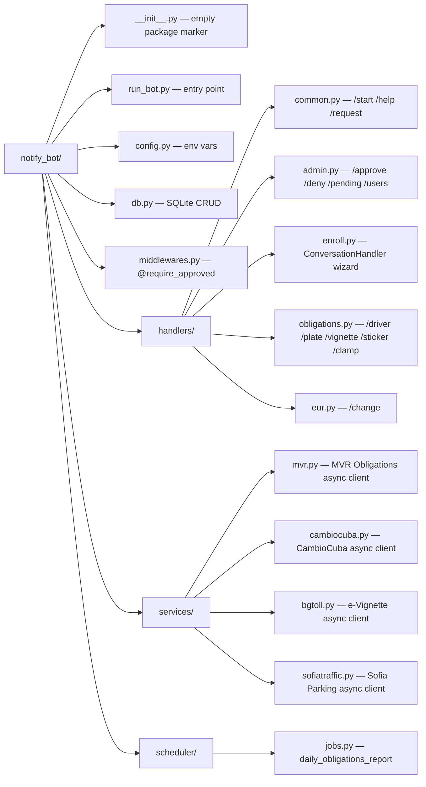
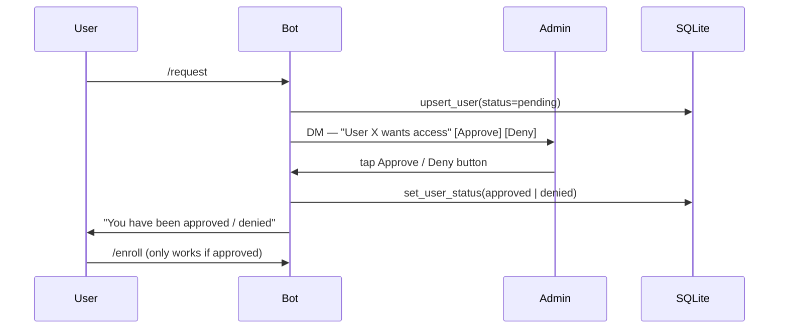
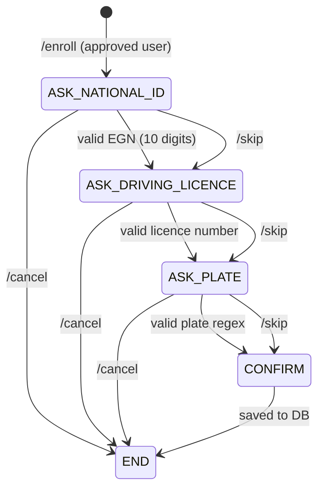
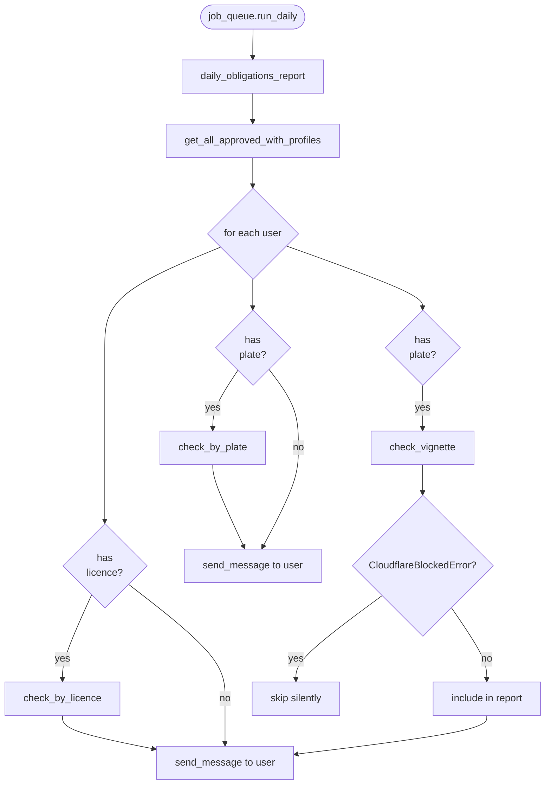
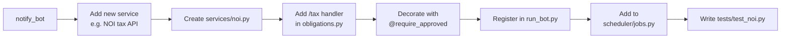

# notify-telegram-bot — Architecture & Reference

A modular, secure, extensible personal Telegram bot for Bulgarian government service checks and
daily notifications.

---

## Architecture Overview

```mermaid
graph TD
    TG([Telegram API])

    subgraph bot["notify_bot package"]
        RB[run_bot.py\nentry point]
        CFG[config.py]
        MW[middlewares.py\n@require_approved]
        DB[(db.py\nSQLite / aiosqlite)]

        subgraph handlers["handlers/"]
            HC[common.py\n/start /help /request]
            HA[admin.py\n/approve /deny /pending /users]
            HE[enroll.py\nConversationHandler wizard]
            HO[obligations.py\n/driver /plate /vignette]
            HU[eur.py\n/change]
        end

        subgraph services["services/"]
            SMVR[mvr.py\nMVR Obligations API]
            SCC[cambiocuba.py\nCambioCuba API]
            SBG[bgtoll.py\ne-Vignette API]
            SST[sofiatraffic.py\nSofia Parking API]
        end

        subgraph scheduler["scheduler/"]
            JQ[jobs.py\ndaily_obligations_report]
        end
    end

    TG <-->|polling| RB
    RB --> handlers
    RB --> CFG
    RB --> JQ
    handlers --> MW
    MW --> DB
    HO --> SMVR
    HO --> SBG
    HO --> SST
    HU --> SCC
    JQ --> SMVR
    JQ --> SBG
    JQ --> SST
    JQ --> DB
```

---

## Package Structure



---

## Design Decisions

| Decision | Choice | Reason |
|---|---|---|
| Storage | SQLite (`aiosqlite`) | No extra service; Redis commented out in compose |
| Auth | Admin approval flow | User IDs unknown upfront; inline Approve/Deny buttons |
| Scheduler | PTB `JobQueue` | Built-in to python-telegram-bot 22.x, zero extra deps |
| HTTP client | `httpx` (async) | Replaces blocking `requests`; fixes event-loop stalls |
| Plate commands | `/plate` + `/vignette` separate | Each checks a distinct API with distinct error modes |

---

## Database Schema

```mermaid
erDiagram
    users {
        INTEGER user_id PK
        TEXT    username
        TEXT    first_name
        TEXT    status
        TEXT    created_at
    }
    user_profiles {
        INTEGER user_id PK_FK
        TEXT    national_id
        TEXT    driving_licence
        TEXT    vehicle_plate
        TEXT    updated_at
    }
    users ||--o| user_profiles : "has profile"
```

`status` values: `pending` · `approved` · `denied`

All profile fields are **nullable** — users can enroll incrementally and skip any field.

---

## Authorization Flow



---

## Enrollment Wizard



---

## MVR Obligations API

```mermaid
flowchart LR
    A[/driver or /plate command] --> B{profile\ncomplete?}
    B -- No --> C[Reply: please /enroll first]
    B -- Yes --> D[mvr.py — GET e-uslugi.mvr.bg]
    D --> E{HTTP status}
    E -- 200 --> F[parse obligationsData]
    E -- other --> G[raise MVRApiError]
    F --> H{obligations\nfound?}
    H -- Yes --> I[Render Jinja2 HTML list]
    H -- No --> J[Reply: no obligations]
```

**Endpoint:** `GET https://e-uslugi.mvr.bg/api/Obligations/AND`

| Mode | Key params |
|---|---|
| By driving licence | `obligatedPersonType=1`, `additinalDataForObligatedPersonType=1`, `mode=1`, `obligedPersonIdent`, `drivingLicenceNumber` |
| By vehicle plate | `obligatedPersonType=1`, `additinalDataForObligatedPersonType=3`, `mode=1`, `obligedPersonIdent`, `foreignVehicleNumber` |

`unitGroup` in response: `1` → Road Traffic Act / Insurance Code · `2` → Bulgarian Personal Documents Law

---

## e-Vignette Check (bgtoll.bg)

```mermaid
flowchart LR
    A[/vignette command] --> B{plate\navailable?}
    B -- arg provided --> C[use arg plate]
    B -- stored in profile --> D[use profile plate]
    B -- neither --> E[Reply: no plate enrolled]
    C --> F[bgtoll.py — GET check.bgtoll.bg]
    D --> F
    F --> G{HTTP status}
    G -- 200 --> H{vignette null?}
    G -- 404 --> I[Reply: no vignette found]
    G -- 403 / 503 --> J[CloudflareBlockedError\nReply: manual link]
    G -- network err --> K[BgtollError\nReply: service unavailable]
    H -- yes --> I
    H -- no --> L[parse VignetteInfo]
    L --> M[Reply: status / validity / type]
```

`/vignette` accepts an optional plate argument: `/vignette CB1234AB`

---

## Daily Scheduler



Configured via `DAILY_REPORT_TIME` (default `08:00` UTC). Registered in `run_bot.py` via
`job_queue.run_daily(daily_obligations_report, time=config.DAILY_REPORT_TIME)`.

The daily report also checks **Sofia parking sticker** and **wheel-clamp** status for each user's
enrolled plate.  Cloudflare errors from sofiatraffic.bg are skipped silently (no spam).
If the vehicle is clamped, an urgent alert is included in the report.

See [api-sofiatraffic.md](api-sofiatraffic.md) for full API reference.

---

## Environment Variables

| Variable | Required | Default | Description |
|---|---|---|---|
| `TOKEN` | ✅ | — | Telegram Bot API token |
| `ADMIN_TELEGRAM_ID` | ✅ | `0` | Owner's Telegram user ID (integer) |
| `DATABASE_PATH` | | `/app/data/bot.db` | SQLite file path |
| `DAILY_REPORT_TIME` | | `08:00` | Daily report time in `HH:MM` UTC |
| `LOGLEVEL` | | `INFO` | Python logging level |

---

## Command Reference

### Public (no approval required)

| Command | Handler | Description |
|---|---|---|
| `/start` | `common.py` | Welcome message; shows approval status |
| `/help` | `common.py` | List all commands |
| `/request` | `common.py` | Request access from the admin |
| `/change` | `eur.py` | EUR exchange rates (Cuba) — public data |

### Approved users only

| Command | Handler | Description |
|---|---|---|
| `/enroll` | `enroll.py` | Wizard to save national ID, driving licence, plate |
| `/driver` | `obligations.py` | Check driving licence obligations via MVR API |
| `/plate` | `obligations.py` | Check vehicle obligations via MVR API |
| `/vignette [PLATE]` | `obligations.py` | Check road e-vignette via bgtoll.bg |
| `/sticker [PLATE]` | `obligations.py` | Check Sofia parking sticker via sofiatraffic.bg |
| `/clamp [PLATE]` | `obligations.py` | Check wheel-clamp status via sofiatraffic.bg |

### Admin only

| Command | Handler | Description |
|---|---|---|
| `/approve <user_id>` | `admin.py` | Approve a pending user |
| `/deny <user_id>` | `admin.py` | Deny a pending user |
| `/pending` | `admin.py` | List users awaiting approval |
| `/users` | `admin.py` | List all approved users |

---

## Future Extensions



- All external API calls live in `services/` — handlers never make HTTP calls directly.
- Adding a new command requires touching `handlers/`, `run_bot.py`, and `scheduler/jobs.py` only.
- Auth is enforced via `@require_approved` decorator — no per-handler boilerplate.
