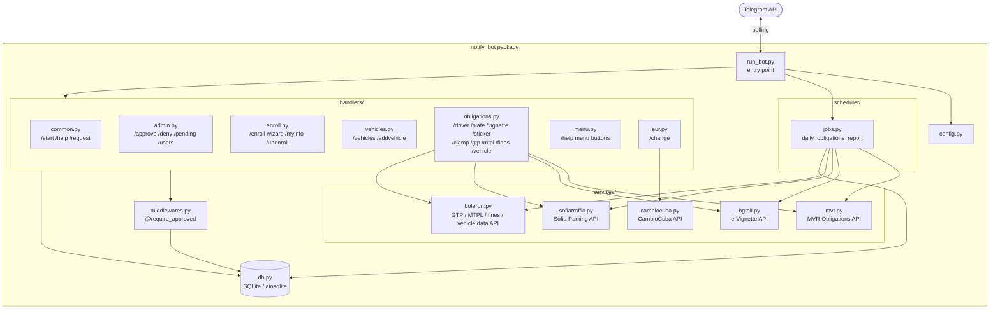
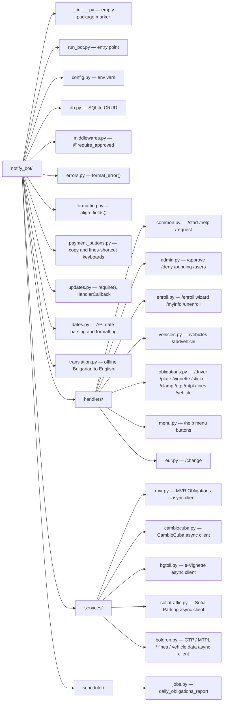
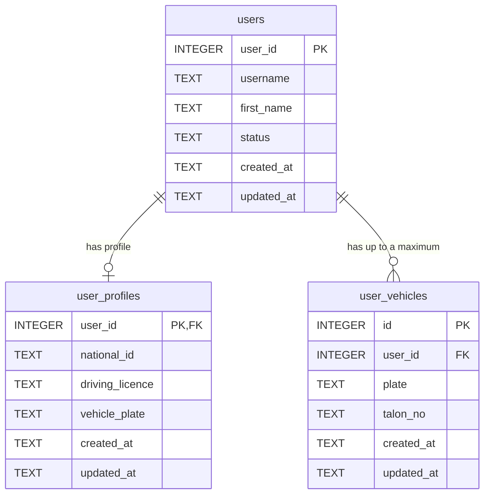
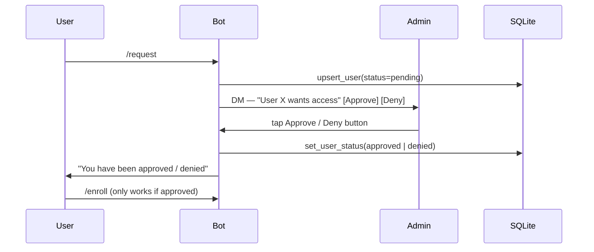
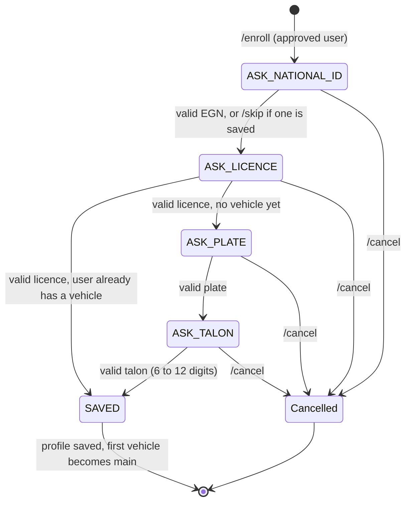
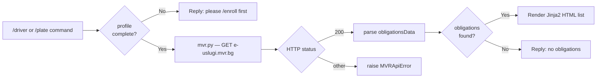
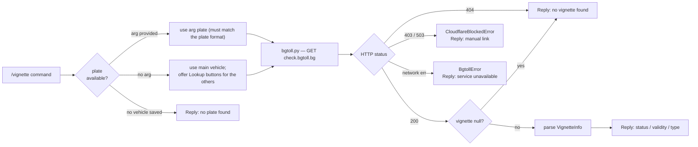
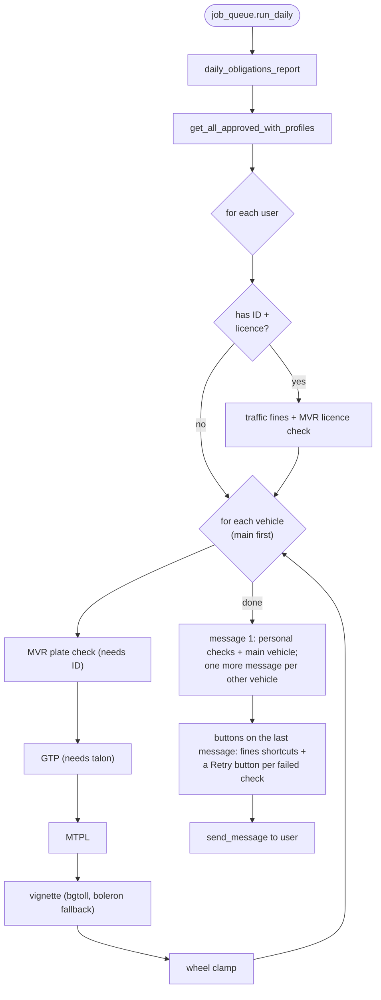
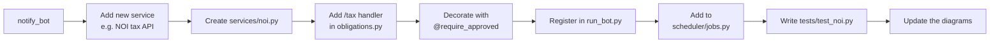

# notify-telegram-bot — Architecture & Reference

A modular, secure, extensible personal Telegram bot for Bulgarian government service checks and
daily notifications.

---

## Architecture Overview

```mermaid
graph TD
    TG(["Telegram API"])

    subgraph bot["notify_bot package"]
        RB["run_bot.py<br/>entry point"]
        CFG["config.py"]
        MW["middlewares.py<br/>@require_approved"]
        DB[("db.py<br/>SQLite / aiosqlite")]

        subgraph handlers["handlers/"]
            HC["common.py<br/>/start /help /request"]
            HA["admin.py<br/>/approve /deny /pending /users"]
            HE["enroll.py<br/>/enroll wizard /myinfo /unenroll"]
            HV["vehicles.py<br/>/vehicles /addvehicle"]
            HO["obligations.py<br/>/driver /plate /vignette /sticker<br/>/clamp /gtp /mtpl /fines /vehicle"]
            HM["menu.py<br/>/help menu buttons"]
            HU["eur.py<br/>/change"]
        end

        subgraph services["services/"]
            SMVR["mvr.py<br/>MVR Obligations API"]
            SCC["cambiocuba.py<br/>CambioCuba API"]
            SBG["bgtoll.py<br/>e-Vignette API"]
            SST["sofiatraffic.py<br/>Sofia Parking API"]
            SBO["boleron.py<br/>GTP / MTPL / fines / vehicle data API"]
        end

        subgraph scheduler["scheduler/"]
            JQ["jobs.py<br/>daily_obligations_report"]
        end
    end

    TG <-->|polling| RB
    RB --> handlers
    RB --> CFG
    RB --> JQ
    handlers --> MW
    handlers --> DB
    MW --> DB
    HO --> SMVR
    HO --> SBG
    HO --> SST
    HO --> SBO
    HU --> SCC
    JQ --> SMVR
    JQ --> SBG
    JQ --> SST
    JQ --> SBO
    JQ --> DB
```

---

## Package Structure

```mermaid
graph LR
    root["notify_bot/"]

    root --> init["__init__.py — empty package marker"]
    root --> rb["run_bot.py — entry point"]
    root --> cfg["config.py — env vars"]
    root --> db["db.py — SQLite CRUD"]
    root --> mw["middlewares.py — @require_approved"]
    root --> err["errors.py — format_error()"]
    root --> fmt["formatting.py — align_fields()"]
    root --> pb["payment_buttons.py — copy and fines-shortcut keyboards"]
    root --> upd["updates.py — require(), HandlerCallback"]
    root --> dt["dates.py — API date parsing and formatting"]
    root --> tr["translation.py — offline Bulgarian to English"]

    root --> h["handlers/"]
    h --> hc["common.py — /start /help /request"]
    h --> ha["admin.py — /approve /deny /pending /users"]
    h --> he["enroll.py — /enroll wizard /myinfo /unenroll"]
    h --> hv["vehicles.py — /vehicles /addvehicle"]
    h --> ho["obligations.py — /driver /plate /vignette /sticker /clamp /gtp /mtpl /fines /vehicle"]
    h --> hm["menu.py — /help menu buttons"]
    h --> hu["eur.py — /change"]

    root --> s["services/"]
    s --> sm["mvr.py — MVR Obligations async client"]
    s --> sc["cambiocuba.py — CambioCuba async client"]
    s --> sb["bgtoll.py — e-Vignette async client"]
    s --> sb2["sofiatraffic.py — Sofia Parking async client"]
    s --> sbo["boleron.py — GTP / MTPL / fines / vehicle data async client"]

    root --> sk["scheduler/"]
    sk --> sj["jobs.py — daily_obligations_report"]
```

---

## Design Decisions

| Decision | Choice | Reason |
|---|---|---|
| Storage | SQLite (`aiosqlite`) | No extra service; Redis commented out in compose |
| Auth | Admin approval flow | User IDs unknown upfront; inline Approve/Deny buttons |
| Scheduler | PTB `JobQueue` | Built-in to python-telegram-bot 22.x, zero extra deps |
| HTTP client | `httpx` (async) | Replaces blocking `requests`; fixes event-loop stalls |
| Plate commands | `/plate` + `/vignette` separate | Each checks a distinct API with distinct error modes |

---

## Database Schema

```mermaid
erDiagram
    users {
        INTEGER user_id PK
        TEXT    username
        TEXT    first_name
        TEXT    status
        TEXT    created_at
        TEXT    updated_at
    }
    user_profiles {
        INTEGER user_id PK, FK
        TEXT    national_id
        TEXT    driving_licence
        TEXT    vehicle_plate
        TEXT    created_at
        TEXT    updated_at
    }
    user_vehicles {
        INTEGER id PK
        INTEGER user_id FK
        TEXT    plate
        TEXT    talon_no
        TEXT    created_at
        TEXT    updated_at
    }
    users ||--o| user_profiles : "has profile"
    users ||--o{ user_vehicles : "has up to a maximum"
```

`user_profiles.vehicle_plate` names the user's main (preferred) vehicle in
`user_vehicles`; `(user_id, plate)` is unique.

`status` values: `pending` · `approved` · `denied`

Profile and vehicle fields are **nullable** in the schema, but the wizards require
each value unless one is already saved.

---

## Authorization Flow

```mermaid
sequenceDiagram
    participant U as User
    participant B as Bot
    participant A as Admin
    participant DB as SQLite

    U->>B: /request
    B->>DB: upsert_user(status=pending)
    B->>A: DM — "User X wants access" [Approve] [Deny]
    A->>B: tap Approve / Deny button
    B->>DB: set_user_status(approved | denied)
    B->>U: "You have been approved / denied"
    U->>B: /enroll  (only works if approved)
```

---

## Enrollment Wizard

```mermaid
stateDiagram-v2
    [*] --> ASK_NATIONAL_ID : /enroll (approved user)
    ASK_NATIONAL_ID --> ASK_LICENCE : valid EGN, or /skip if one is saved
    ASK_NATIONAL_ID --> Cancelled : /cancel
    ASK_LICENCE --> SAVED : valid licence, user already has a vehicle
    ASK_LICENCE --> ASK_PLATE : valid licence, no vehicle yet
    ASK_LICENCE --> Cancelled : /cancel
    ASK_PLATE --> ASK_TALON : valid plate
    ASK_PLATE --> Cancelled : /cancel
    ASK_TALON --> SAVED : valid talon (6 to 12 digits)
    ASK_TALON --> Cancelled : /cancel
    SAVED --> [*] : profile saved, first vehicle becomes main
    Cancelled --> [*]
```

A step can be skipped only when a value is already saved for it; `/back` returns
to the previous step.  Once the user has a vehicle, `/enroll` updates just the
national ID and licence; more vehicles are added with `/addvehicle`, whose plate
and talon are both required.

---

## MVR Obligations API

```mermaid
flowchart LR
    A["/driver or /plate command"] --> B{"profile<br/>complete?"}
    B -- No --> C["Reply: please /enroll first"]
    B -- Yes --> D["mvr.py — GET e-uslugi.mvr.bg"]
    D --> E{"HTTP status"}
    E -- 200 --> F["parse obligationsData"]
    E -- other --> G["raise MVRApiError"]
    F --> H{"obligations<br/>found?"}
    H -- Yes --> I["Render Jinja2 HTML list"]
    H -- No --> J["Reply: no obligations"]
```

**Endpoint:** `GET https://e-uslugi.mvr.bg/api/Obligations/AND`

| Mode | Key params |
|---|---|
| By driving licence | `obligatedPersonType=1`, `additinalDataForObligatedPersonType=1`, `mode=1`, `obligedPersonIdent`, `drivingLicenceNumber` |
| By vehicle plate | `obligatedPersonType=1`, `additinalDataForObligatedPersonType=3`, `mode=1`, `obligedPersonIdent`, `foreignVehicleNumber` |

`unitGroup` in response: `1` → Road Traffic Act / Insurance Code · `2` → Bulgarian Personal Documents Law

---

## e-Vignette Check (bgtoll.bg)

```mermaid
flowchart LR
    A["/vignette command"] --> B{"plate<br/>available?"}
    B -- arg provided --> C["use arg plate (must match the plate format)"]
    B -- no arg --> D["use main vehicle;<br/>offer Lookup buttons for the others"]
    B -- no vehicle saved --> E["Reply: no plate found"]
    C --> F["bgtoll.py — GET check.bgtoll.bg"]
    D --> F
    F --> G{"HTTP status"}
    G -- 200 --> H{"vignette null?"}
    G -- 404 --> I["Reply: no vignette found"]
    G -- 403 / 503 --> J["CloudflareBlockedError<br/>Reply: manual link"]
    G -- network err --> K["BgtollError<br/>Reply: service unavailable"]
    H -- yes --> I
    H -- no --> L["parse VignetteInfo"]
    L --> M["Reply: status / validity / type"]
```

`/vignette` accepts an optional plate argument: `/vignette CB1234AB`.  The other
plate commands (`/plate`, `/sticker`, `/clamp`, `/gtp`, `/mtpl`, `/vehicle`)
pick their vehicle the same way.

---

## Daily Scheduler

```mermaid
flowchart TD
    T(["job_queue.run_daily"]) --> J["daily_obligations_report"]
    J --> Q["get_all_approved_with_profiles"]
    Q --> U{"for each user"}
    U --> LIC{"has ID +<br/>licence?"}
    LIC -- yes --> F["traffic fines + MVR licence check"]
    LIC -- no --> V
    F --> V{"for each vehicle<br/>(main first)"}
    V --> P["MVR plate check (needs ID)"]
    P --> G["GTP (needs talon)"]
    G --> M["MTPL"]
    M --> VI["vignette (bgtoll, boleron fallback)"]
    VI --> C["wheel clamp"]
    C --> V
    V -- done --> R["message 1: personal checks + main vehicle;<br/>one more message per other vehicle"]
    R --> K["buttons on the last message: fines shortcuts +<br/>a Retry button per failed check"]
    K --> S["send_message to user"]
```

Configured via `DAILY_REPORT_TIME` (default `08:00` UTC). Registered in `run_bot.py` via
`job_queue.run_daily(daily_obligations_report, time=config.DAILY_REPORT_TIME)`.

Every saved vehicle is checked.  A check that fails still gets a section, and the
report gets a 🔁 Retry button that re-runs that command for that plate.  The
**parking sticker** isn't in the report (sofiatraffic.bg misses active stickers
too often); `/sticker` still checks it.  If a vehicle is clamped, the report
says so.

See [api-sofiatraffic.md](api-sofiatraffic.md) for full API reference.

---

## Environment Variables

| Variable | Required | Default | Description |
|---|---|---|---|
| `TOKEN` | ✅ | — | Telegram Bot API token |
| `ADMIN_TELEGRAM_ID` | ✅ | `0` | Owner's Telegram user ID (integer) |
| `DEBUG_USER_IDS` | | — | Comma-separated user IDs that get full error detail, like the admin |
| `DATABASE_PATH` | | `/app/data/bot.db` | SQLite file path |
| `LOG_FILE_PATH` | | `/app/data/errors.log` | Rotating file that keeps only ERROR+ log records |
| `LOG_FILE_MAX_BYTES` | | `100000` | Size at which the error log rotates |
| `LOG_FILE_BACKUP_COUNT` | | `1` | Rotated error logs to keep |
| `DAILY_REPORT_TIME` | | `08:00` | Daily report time in `HH:MM` UTC |
| `LOGLEVEL` | | `INFO` | Python logging level |
| `MVR_SESSION_ID` | | built-in | MVR e-services session cookie; set a new one when it expires |
| `FLARESOLVERR_URL` | | — | FlareSolverr endpoint the Sofia Traffic checks use to get past Cloudflare |
| `BOLERON_FIREBASE_API_KEY` | | built-in | Public boleron.bg key for anonymous sign-in; override to rotate it |

---

## Command Reference

### Public (no approval required)

| Command | Handler | Description |
|---|---|---|
| `/start` | `common.py` | Welcome message; shows approval status |
| `/help` | `common.py` | List all commands |
| `/request` | `common.py` | Request access from the admin |
| `/change` | `eur.py` | EUR exchange rates (Cuba) — public data |

### Approved users only

| Command | Handler | Description |
|---|---|---|
| `/enroll` | `enroll.py` | Wizard to save national ID, driving licence, main vehicle |
| `/myinfo` | `enroll.py` | Show saved personal data and vehicles |
| `/unenroll` | `enroll.py` | Delete saved personal data and all vehicles |
| `/vehicles`, `/addvehicle` | `vehicles.py` | List, add, remove vehicles; choose the main one |
| `/driver` | `obligations.py` | Check driving licence obligations via MVR API |
| `/plate [PLATE]` | `obligations.py` | Check vehicle obligations via MVR API |
| `/vignette [PLATE]` | `obligations.py` | Check road e-vignette via bgtoll.bg |
| `/sticker [PLATE]` | `obligations.py` | Check Sofia parking sticker via sofiatraffic.bg |
| `/clamp [PLATE]` | `obligations.py` | Check wheel-clamp status via sofiatraffic.bg |
| `/gtp [PLATE [TALON]]` | `obligations.py` | Check technical inspection via boleron.bg |
| `/mtpl [PLATE]` | `obligations.py` | Check civil liability insurance via boleron.bg |
| `/fines` | `obligations.py` | Check traffic fines via boleron.bg |
| `/vehicle [PLATE]` | `obligations.py` | Show vehicle registration data via boleron.bg |

Without `PLATE`, plate commands use the main vehicle.

### Admin only

| Command | Handler | Description |
|---|---|---|
| `/approve <user_id>` | `admin.py` | Approve a pending user |
| `/deny <user_id>` | `admin.py` | Deny a pending user |
| `/pending` | `admin.py` | List users awaiting approval |
| `/users` | `admin.py` | List all approved users |

---

## Future Extensions

```mermaid
flowchart LR
    A["notify_bot"] --> B["Add new service<br/>e.g. NOI tax API"]
    B --> C["Create services/noi.py"]
    C --> D["Add /tax handler<br/>in obligations.py"]
    D --> E["Decorate with<br/>@require_approved"]
    E --> F["Register in run_bot.py"]
    F --> G["Add to<br/>scheduler/jobs.py"]
    G --> H["Write tests/test_noi.py"]
    H --> I["Update the diagrams"]
```

- All external API calls live in `services/` — handlers never make HTTP calls directly.
- Adding a new command requires touching `handlers/`, `run_bot.py`, and `scheduler/jobs.py` only.
- Auth is enforced via `@require_approved` decorator — no per-handler boilerplate.
